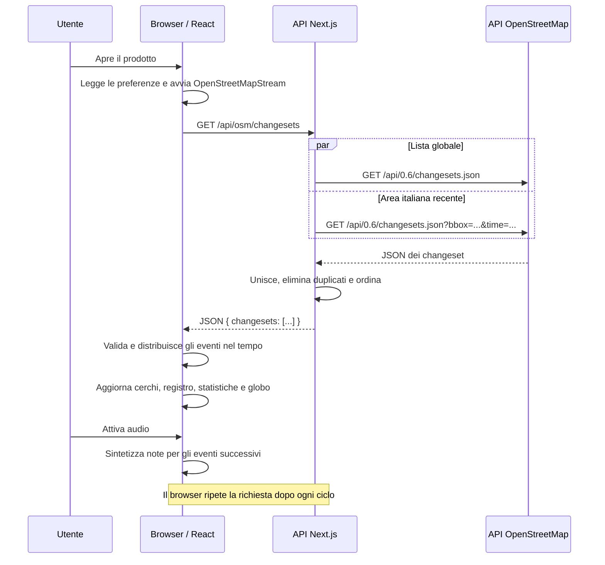

# Presentazione — Listen to OpenStreetMap

## 1. Il prodotto

**Listen to OpenStreetMap trasforma l’attività della mappa in un’esperienza visiva e musicale.**

Gli aggiornamenti diventano cerchi animati, punti su un pianeta 3D e note musicali. L’utente può scegliere scala, volume, filtri hashtag e accompagnamento MP3.

L’unità osservata è il **changeset**: un gruppo di aggiornamenti OpenStreetMap, che può contenere aggiunte, modifiche e rimozioni di più oggetti.

> Frase da presentare: «Il prodotto rende percepibile l’attività di una comunità: ogni gruppo di aggiornamenti alla mappa può diventare un evento visivo e sonoro».

## 2. Architettura e flusso delle API

Il progetto usa Next.js e React. Il browser gestisce interfaccia, filtri, rendering e audio; una rotta Next.js raccoglie i dati dal servizio esterno.



**La fonte attiva è OpenStreetMap.** Nel repository restano nomi storici come `WikipediaApp`, `useWikipedia` e `WikiEvent`, ma il servizio istanziato dall’app è `OpenStreetMapStream`.

## 3. Quali API vengono chiamate

| Chiamante → destinatario | Metodo e URL | Scopo | Avvio / frequenza |
| --- | --- | --- | --- |
| Browser → backend del prodotto | `GET /api/osm/changesets` | Ricevere una lista unificata di changeset | Subito dopo l’inizializzazione delle preferenze; poi a ogni ciclo di polling |
| Backend → OpenStreetMap | `GET https://api.openstreetmap.org/api/0.6/changesets.json` | Ottenere i changeset globali recenti | Durante la gestione della rotta interna, con cache Next.js e rivalidazione a 15 secondi |
| Backend → OpenStreetMap | `GET https://api.openstreetmap.org/api/0.6/changesets.json?bbox=6.6,35.4,18.6,47.2&time=<timestamp>` | Integrare i changeset recenti nell’area italiana | In parallelo alla richiesta globale, con la stessa politica di cache |

Le chiamate applicative sono tutte `GET`, senza body. L’app legge l’attività pubblica: non invia modifiche alla mappa. Il percorso attuale non richiede chiavi API o autenticazione OSM.

## 4. Cosa invia il browser e cosa invia il server

### Richiesta del browser

```http
GET /api/osm/changesets
```

Il browser non aggiunge parametri di lingua, hashtag o posizione dell’utente. I filtri hashtag vengono applicati dopo la ricezione dei dati, nel client.

### Richieste del backend

Il server manda due richieste parallele a OpenStreetMap, con questi header espliciti:

```http
Accept: application/json
User-Agent: ListenToOpenStreetMap/1.0
```

La seconda richiesta aggiunge:

- `bbox=6.6,35.4,18.6,47.2`: rettangolo geografico usato per coprire l’area italiana, comprese Sicilia e Sardegna. Il rettangolo può includere anche aree di paesi vicini.
- `time=<timestamp ISO codificato nell’URL>`: inizio della finestra recente, calcolato circa dieci minuti prima, dopo aver arrotondato il momento corrente a intervalli di 15 secondi.

Questi parametri sono calcolati dal server; non dipendono dalla posizione del visitatore o dalla vista selezionata.

## 5. Il lavoro dell’API interna

La rotta `src/app/api/osm/changesets/route.ts`:

1. Avvia le due richieste con `Promise.allSettled`, così un errore di una fonte non impedisce di usare l’altra.
2. Imposta un timeout di **12 secondi per richiesta esterna**.
3. Chiede a Next.js di riutilizzare i dati con `next: { revalidate: 15 }`.
4. Legge l’array `changesets`, oppure `elements` come formato alternativo.
5. Unisce i risultati usando l’ID del changeset come chiave.
6. Per uno stesso ID conserva la versione con il maggiore `changes_count`.
7. Ordina per ID decrescente e restituisce `{ "changesets": [...] }`.

Se una richiesta fallisce, la risposta può comunque essere `200` con i dati dell’altra. Se entrambe falliscono, il server risponde `502`:

```json
{
  "error": "OpenStreetMap temporaneamente non disponibile"
}
```

La cache riguarda le letture esterne del backend: la chiamata del browser alla rotta interna non implica sempre un nuovo accesso a OSM.

## 6. Quali dati arrivano

Esempio illustrativo dei campi usati dall’app, non una risposta acquisita dal servizio:

```json
{
  "changesets": [
    {
      "id": 123456,
      "user": "MapperExample",
      "changes_count": 12,
      "min_lat": 45.46,
      "max_lat": 45.48,
      "min_lon": 9.18,
      "max_lon": 9.20,
      "tags": {
        "comment": "Aggiornamento edifici #survey",
        "hashtags": "#survey"
      }
    }
  ]
}
```

| Campo | Uso nel prodotto |
| --- | --- |
| `id` | Identifica il changeset e costruisce il collegamento ai dettagli OSM |
| `user` | Mostra il nome dell’autore e costruisce il link al profilo |
| `changes_count` | Misura gli oggetti aggiornati; alimenta dimensione del cerchio e scelta della nota |
| `tags.comment` | Diventa il titolo dell’evento; in sua assenza si usa `Changeset #<id>` |
| `tags.hashtags` e hashtag nel commento | Alimentano i filtri locali |
| `min_lat`, `max_lat`, `min_lon`, `max_lon` | Permettono di calcolare il punto sul globo |
| `tags.bot` | Segnala un bot quando il valore è `yes` |

La risposta contiene riepiloghi dei changeset. Il prodotto non scarica il dettaglio di ogni singolo oggetto modificato.

## 7. Come funzionano polling e aggiornamenti

`OpenStreetMapStream` esegue la prima richiesta immediatamente. Per ogni risposta:

1. Scorre la lista in ordine inverso, rispetto all’ordinamento ricevuto.
2. Valida ogni changeset con `normalizeChangeset`: ID positivo, utente testuale e conteggio positivo.
3. Confronta il conteggio con quello già osservato per lo stesso ID.
4. Se il changeset è nuovo, genera un evento con il conteggio totale.
5. Se il conteggio è aumentato, genera un evento con il solo incremento; se è uguale o inferiore, lo scarta.
6. Distribuisce gli eventi con una pausa di `min(500 ms, 10.000 ms / numero eventi)` tra un evento e il successivo.
7. Finita l’elaborazione del lotto, attende **15 secondi** prima del nuovo polling.

**I 15 secondi sono una pausa dopo il ciclo**, non una frequenza esatta tra gli inizi delle richieste. Si aggiungono il tempo di rete e quello di distribuzione degli eventi.

Il primo caricamento presenta anche attività già recente. L’esperienza è aggiornata periodicamente: non usa un flusso push OSM e non garantisce di catturare tutti gli aggiornamenti globali.

In caso di errore, lo stato passa a `reconnecting` e il servizio tenta di nuovo dopo 15 secondi. Quando il componente viene smontato, annulla la richiesta e ferma i timer.

## 8. Dal JSON alla visualizzazione e alla musica

La normalizzazione produce un evento interno `WikiEvent` con ID `osm:<id>:<changes_count>`. Il campo `delta` contiene il conteggio totale alla prima osservazione, oppure l’incremento nelle osservazioni successive.

`useWikipedia` elimina ulteriori duplicati e applica i filtri hashtag. Gli eventi corrispondenti aggiornano contatore, frequenza e registro; quelli esclusi possono restare visibili come cerchi attenuati e silenziosi.

- **Cerchi:** fino a 180 eventi grafici; gli eventi OSM scadono dopo 60 secondi.
- **Registro:** ultimi 20 eventi corrispondenti ai filtri.
- **Pianeta:** riceve la lista del registro e mostra gli eventi con coordinate valide. Il flusso attuale gli passa quindi al massimo 20 eventi, anche se un’etichetta della UI riporta `/100`.
- **Posizione:** centro del bounding box del changeset, calcolato facendo la media delle latitudini e delle longitudini minime e massime. È una posizione approssimativa dell’area aggiornata.
- **Audio:** dopo l’attivazione dell’utente, Tone.js sintetizza note nella scala scelta; conteggi maggiori producono note più basse. Eventuali segmenti MP3 possono accompagnarle.

Il conteggio OSM non distingue, in questa pipeline, aggiunte da rimozioni: il `delta` emesso è positivo. La presenza di un sintetizzatore per rimozioni nel motore audio non significa che l’app riconosca le cancellazioni dai riepiloghi ricevuti.

## 9. Altre richieste: file statici e collegamenti

| Risorsa | Quando viene richiesta | Funzione |
| --- | --- | --- |
| `/geo/countries-110m.json` | All’apertura del pianeta; anche alla prima selezione della musica per posizione | Confini del globo e riconoscimento locale del paese |
| `/sounds/swells/swell1.mp3`, `swell2.mp3`, `swell3.mp3` | All’inizializzazione dell’audio | Campioni caricati dal motore; il flusso OSM attuale genera eventi `edit`, non annunci `welcome` |
| `/location/italy.mp3` | Quando la modalità geografica seleziona il brano italiano, se non già nella cache audio | Accompagnamento musicale per eventi localizzati in Italia |
| URL del brano selezionato | Alla selezione, se non già nella cache audio | Caricamento e decodifica dell’MP3 |

Queste sono richieste di asset, non API esterne di dati. I file MP3 scelti dal computer vengono letti tramite URL `blob:` nel browser: non vengono caricati sul server.

Il clic su un evento apre `https://www.openstreetmap.org/changeset/<id>` in una nuova scheda; il link all’autore apre `https://www.openstreetmap.org/user/<nome codificato>`. Sono navigazioni verso pagine web.

## 10. Distinzione dal vecchio flusso Wikipedia

`src/services/WikimediaStream.ts` contiene ancora una connessione SSE:

```text
https://stream.wikimedia.org/v2/stream/recentchange
```

Quel servizio usa `EventSource` per ricevere messaggi continui e beneficiare della riconnessione automatica del browser, ma **non è istanziato nel flusso attuale dell’app**.

Il codice attuale non chiama API Wikipedia/Wikidata per ottenere coordinate e non incorpora Street View. Alcune parti del README e della documentazione descrivono funzionalità precedenti; questa presentazione segue il codice effettivamente collegato alla pagina.

## 11. Traccia breve per l’esposizione

> «Quando apro l’app, il browser chiama la nostra API Next.js. Il server legge in parallelo due liste da OpenStreetMap: una globale e una dedicata all’area italiana recente. Unisce i risultati, rimuove i duplicati e restituisce JSON. Il browser riconosce nuovi changeset e aumenti di attività, li distribuisce nel tempo e aggiorna cerchi, registro e globo. Dopo l’attivazione dell’audio, gli stessi eventi producono musica. Il ciclo viene ripetuto con polling, mentre la cache del server riduce gli accessi al servizio esterno».

## Riferimenti nel repository

- [Pagina e metadati del prodotto](src/app/layout.tsx)
- [Composizione dell’interfaccia](src/components/WikipediaApp.tsx)
- [Hook: eventi, filtri, statistiche e audio](src/hooks/useWikipedia.ts)
- [Polling e deduplicazione OSM](src/services/OpenStreetMapStream.ts)
- [API interna e richieste esterne](src/app/api/osm/changesets/route.ts)
- [Normalizzazione dei changeset](src/lib/osm.ts)
- [Pianeta e dati visualizzati](src/components/globe/PlanetView.tsx)
- [Motore audio e caricamento MP3](src/services/AudioEngine.ts)
- [Selezione musicale per paese](src/lib/locationMusic.ts)
- [Test della rotta OSM](tests/osm-route.test.ts)
- [Test della normalizzazione e del servizio OSM](tests/osm.test.ts)

Documento ricostruito dal codice del repository il 4 ottobre 2026. Gli esempi descrivono l’implementazione; non costituiscono una verifica live della disponibilità delle API esterne.
